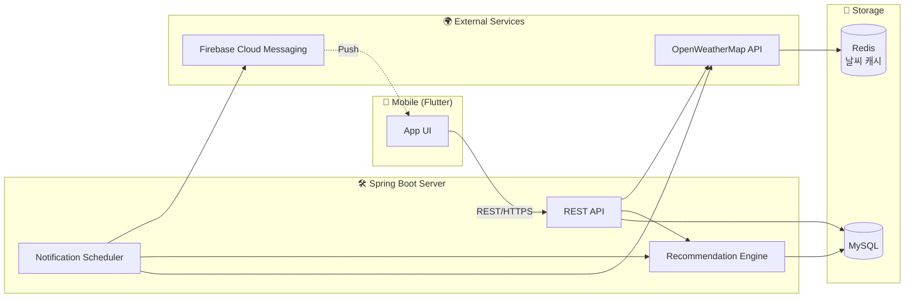

# OMO · 시스템 아키텍처

## 구성 요소

| 컴포넌트 | 역할 |
|----------|------|
| Mobile (Flutter) | 사용자 인터페이스, FCM 토큰 등록, 토스트 알림 UI |
| REST API | 인증, 추천 조회, 피드백 기록, 마이페이지 데이터 제공 |
| Notification Scheduler | 분 단위 cron으로 대상 유저 조회 → 추천 생성 → FCM 발송 |
| Recommendation Engine | 날씨 + 유저 보정값 기반으로 옷차림 결정 |
| Redis | 동일 지역/시간 날씨 조회 결과 캐싱 (외부 API 호출 최소화) |
