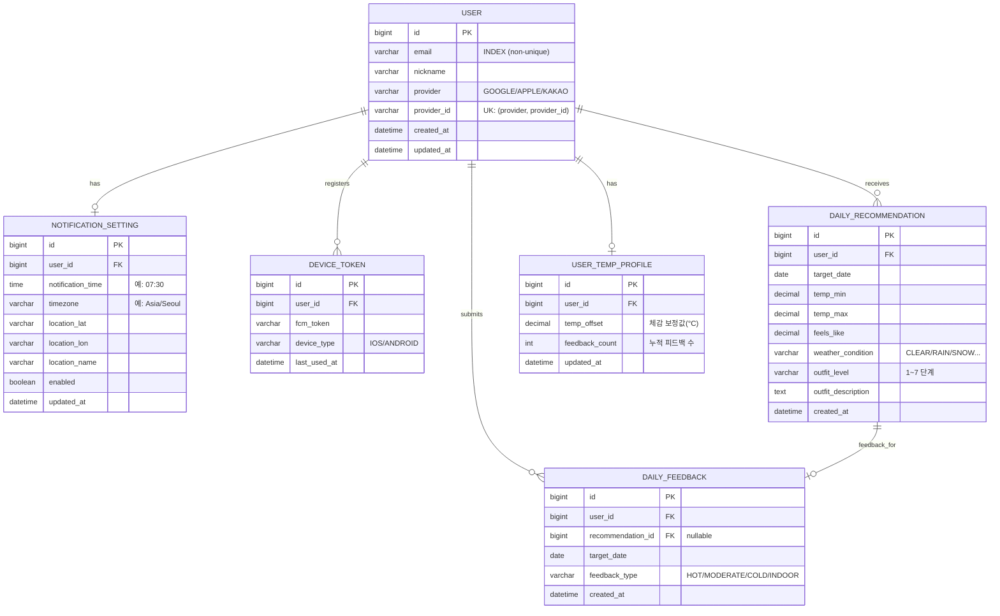

# OMO · ERD

## 핵심 설계 포인트

- `USER.email`은 unique key가 **아님** — 동일 이메일로 Google/Apple/Kakao 각각 가입 시 별개 계정으로 처리. unique key는 `(provider, provider_id)` 쌍
- `DAILY_RECOMMENDATION`은 알림 발송 시점에 미리 생성 → 앱에서 조회만 (응답 속도 ↑)
- `DAILY_FEEDBACK`은 추천과 1:1 연결되지만 `INDOOR`인 경우 추천과 무관하게 기록 가능
- `USER_TEMP_PROFILE.temp_offset`: 피드백 누적 시 점진적으로 업데이트되는 개인화 보정값
  - 양수 → "더위를 잘 타는 유저" → 추천 옷차림 한 단계 가볍게
  - 음수 → "추위를 잘 타는 유저" → 추천 옷차림 한 단계 두껍게
