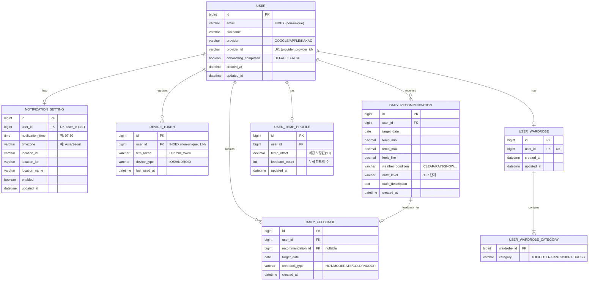

# OMO · ERD

## 핵심 설계 포인트

- `USER.email`은 unique key가 **아님** — 동일 이메일로 Google/Apple/Kakao 각각 가입 시 별개 계정으로 처리. unique key는 `(provider, provider_id)` 쌍
- `DAILY_RECOMMENDATION`은 알림 발송 시점에 미리 생성 → 앱에서 조회만 (응답 속도 ↑)
- `DAILY_FEEDBACK`은 추천과 1:1 연결되지만 `INDOOR`인 경우 추천과 무관하게 기록 가능
- `USER_TEMP_PROFILE.temp_offset`: 피드백 누적 시 점진적으로 업데이트되는 개인화 보정값
  - 양수 → "더위를 잘 타는 유저" → 추천 옷차림 한 단계 가볍게
  - 음수 → "추위를 잘 타는 유저" → 추천 옷차림 한 단계 두껍게
- `USER_WARDROBE`는 유저당 1개로 고정 (UK: `user_id`). 옷장 카테고리는 `USER_WARDROBE_CATEGORY`에 행 단위로 저장되며, 설정할 때마다 전체 교체된다
- `NOTIFICATION_SETTING`은 유저당 0..1개 (UK: `user_id`, `uk_notification_setting_user_id`로 1:1 강제). `notification_time`은 미설정(NULL) 허용, `timezone`은 기본 `Asia/Seoul`·`enabled`는 기본 `true`로 애플리케이션 팩토리(`init()`)에서 초기화된다 (DB DEFAULT 미부여). `updated_at`은 `BaseEntity`가 제공
- `DEVICE_TOKEN`은 유저당 여러 개 (1:N). `user_id`엔 UNIQUE가 아닌 조회용 일반 인덱스(`idx_device_token_user_id`)를 걸고, `fcm_token`에 UNIQUE(`uk_device_token_fcm_token`)로 동일 토큰 중복 등록을 막는다. `device_type`은 `IOS`/`ANDROID` enum(`@Enumerated(STRING)`), `last_used_at`은 토큰 마지막 사용 시각으로 `register()` 시 `now()`로 채워진다 (`created_at`/`updated_at`과 별개 의미)
- `USER_TEMP_PROFILE`은 온보딩 시 초기값(체감 민감도 → `temp_offset`)으로 생성되며 이후 피드백으로 점진 갱신된다. 이미 생성된 경우 재설정 호출은 무시된다
