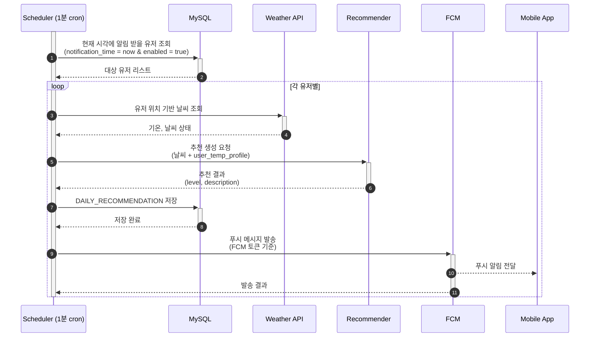
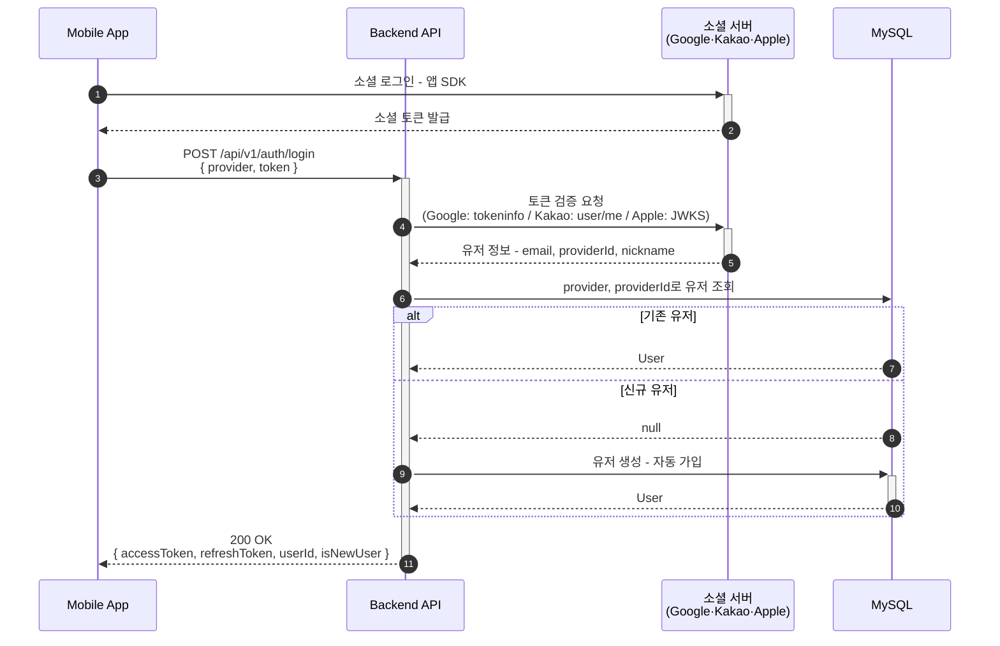
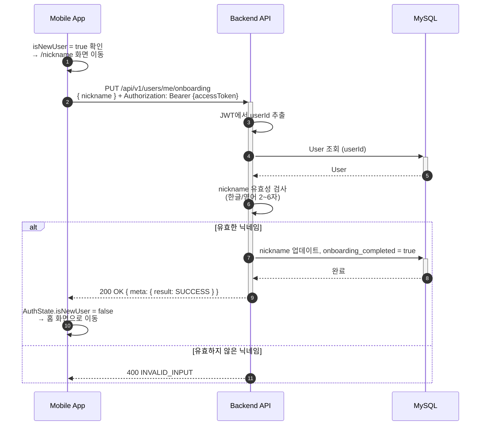
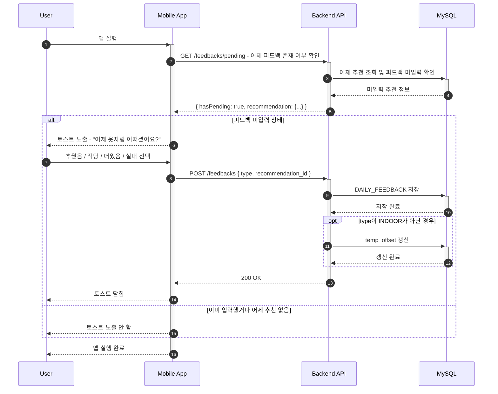
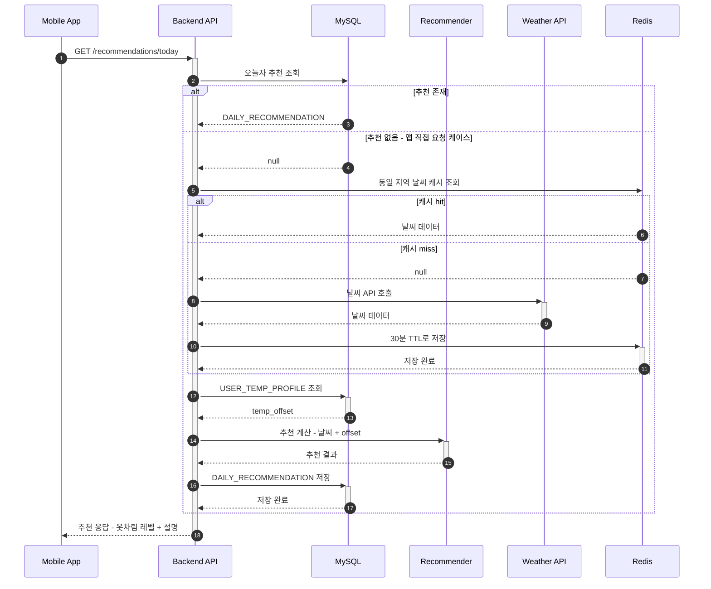

# OMO · 시퀀스 다이어그램

## 1. 일일 알림 발송 흐름

## 2. 소셜 로그인 흐름

- `isNewUser = true`이면 앱이 닉네임 설정 화면(`/nickname`)으로 이동한다.
- `isNewUser`는 `onboarding_completed`의 반전값이다. 온보딩 완료 후 재로그인하면 `false`를 반환한다.

> Apple은 SDK에서 받은 identityToken(RS256 JWT)을 Apple JWKS 공개키로 직접 검증한다. Google·Kakao와 달리 별도 검증 API 엔드포인트가 없다.

## 3. 온보딩 — 닉네임 설정

## 3. 앱 진입 → 피드백 토스트 흐름

## 4. 옷차림 추천 조회 + 개인화 보정

